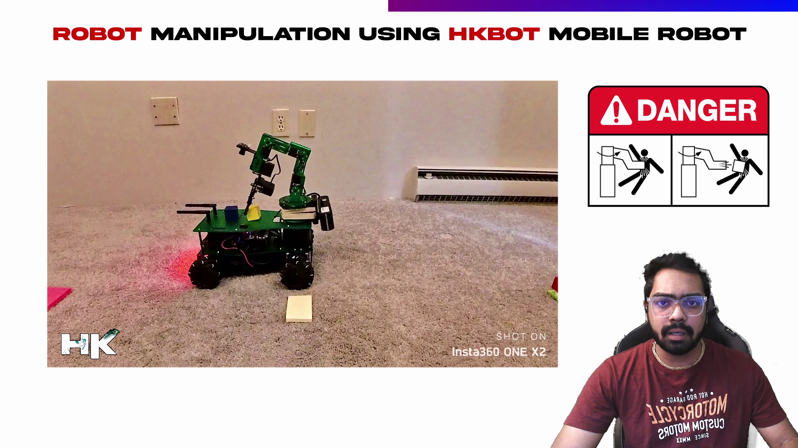

<!------ PROJECT TITLE ------>

    

    

<!------ WHAT ------>

    

<h1>🎀 Essence of the Project</h1>

This project focuses on developing a specialized algorithm for the HKBOT, which is equipped with an NVIDIA Jetson Nano and a 6-DOF robotic arm. The algorithm enhances 'pick and place' operations, dynamically adapting to different payload configurations and optimizing the spatial arrangement of blocks on the robot’s chassis. Integrated safety protocols ensure the robot operates in compliance with guidelines for mobile robots and autonomous guided vehicles.

  

 
    

<!------ WHY ------>

    

<h1>🎯 Project Vision</h1>

The aim of this project is to advance block manipulation by integrating a specialized non-autonomous algorithm with a 6-DOF robotic arm, serving as a beginner project in robotic arm and block manipulation. This initiative seeks to enhance operational efficiency and robotic mobility through the use of mecanum wheels for precise omnidirectional movement, coupled with dynamic adaptation to various payload configurations. Safety protocols are implemented to ensure compliance with the highest standards, promoting secure and efficient operations in autonomous mobile robotics.

 
    

<!------ HOW ------>

    

<h1>🪓 Project Implementation</h1>

<h2>💠 Software Design & Tools </h2>

This project employs a robust suite of tools to support the development and operation of HKBOT. Ubuntu and Linux provide a stable and versatile operating system environment. C++ is utilized for scripting, enhancing the project's efficiency and scalability. Communication and remote control functionalities are handled through SSH, PuTTY, and VNC Viewer, ensuring secure and flexible remote access. ROS and RViz are essential for managing robotic operations and visualizations.

 &nbsp;
 &nbsp;
 &nbsp;
 &nbsp;
 &nbsp;
 &nbsp;
 &nbsp;
 &nbsp;

  

<!------ Technical Terms ------>

<h2>💠 Project Technical Terms & Concepts </h2>

<h3>▸ What is an AGV Robot?</h3>

An AGV (Automated Guided Vehicle) Robot is an autonomous robot used primarily in industrial settings to transport materials around a manufacturing facility or warehouse. AGVs follow predefined paths marked by wires, tapes, or lasers, performing tasks that typically require minimal deviation from set routes. They are known for improving operational efficiency, reducing labor costs, and enhancing workplace safety.

  

<h3>▸ What is an AMR Robot?</h3>

An AMR (Autonomous Mobile Robot) is a more advanced type of autonomous robot that, unlike AGVs, can navigate in an environment without the need for predefined paths. AMRs use sophisticated sensors, cameras, and algorithms to understand their environment, making decisions in real-time to find the most efficient routes, avoid obstacles, and adapt to changes. This capability makes them highly versatile and suitable for a variety of applications beyond industrial logistics, including healthcare and service industries.

  

<h3>▸ What is an AMMR Robot?</h3>

AMMR (Autonomous Mobile Manipulation Robot) combines the capabilities of AMRs with robotic arms or other manipulators, enabling not only autonomous navigation but also the ability to interact physically with their environment. These robots can perform more complex tasks such as picking, sorting, and handling of objects, integrating the mobility of AMRs with the functionality of robotic manipulators. AMMRs are particularly useful in environments where both mobility and manipulative actions are required, such as in automated production lines or fulfillment centers.

  

<h2>💠 Deployment and Testing</h2>

<h3>▸ Manipulation Sequence Planning</h2>

I have designed the algorithm for the robotic arm in a way that is referred to as 'manipulation sequence' or 'manipulation planning' in robotics. When the robot's chassis already holds one or two blocks, it needs space to place an additional block. My developed algorithm directs the arm to push the existing blocks slightly backward, creating room for the new one. This process can repeat for any number of blocks, as demonstrated in the video.  

<h3>▸ Implemented Safety Measures for Operating AMRs/AGVs</h2>

As we all know, robots can pose a hazard if we enter their operational zone. To address safety concerns on sites and factories that use mobile robots and Autonomous Guided Vehicles (AGVs), I have programmed an algorithm to enhance safety communications. When the robot is performing a manipulation task, it emits a flashing red light. Conversely, when the robot is merely moving around, it emits a green light, signaling to humans that it is safe to approach. However, it is unsafe to approach when the robot flashes a red light. 
  

<h2>Red: Danger</h2>

  

  

<h2>Green: Safe</h2>

  

 
    

<!----- End Image ----->

    

