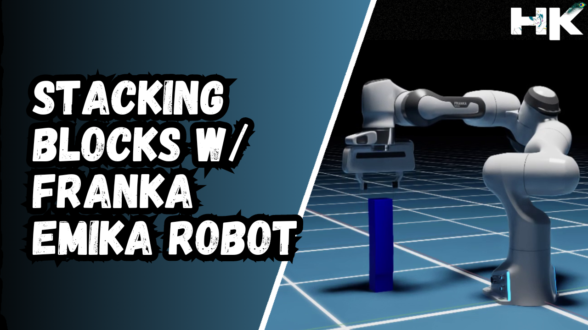
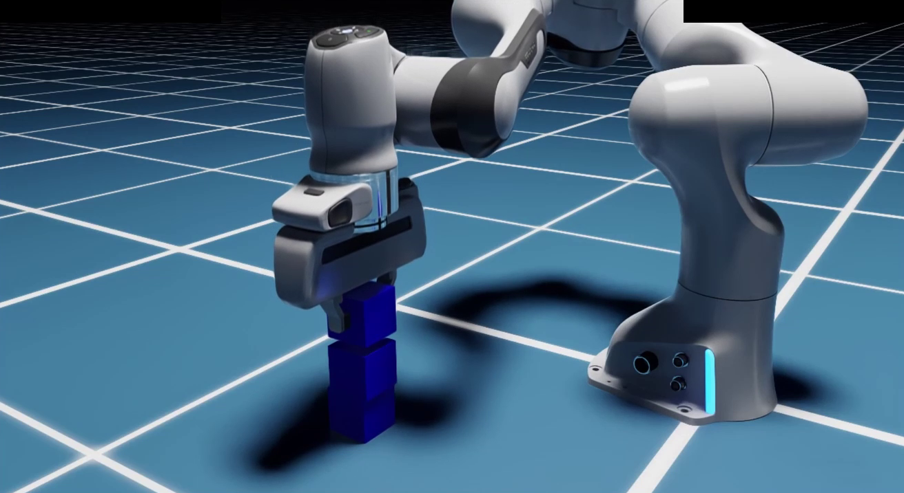
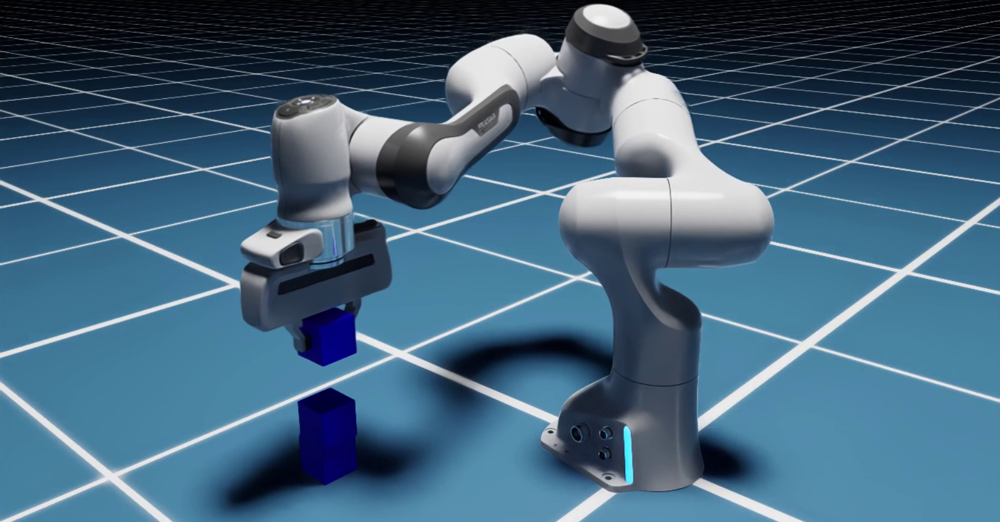
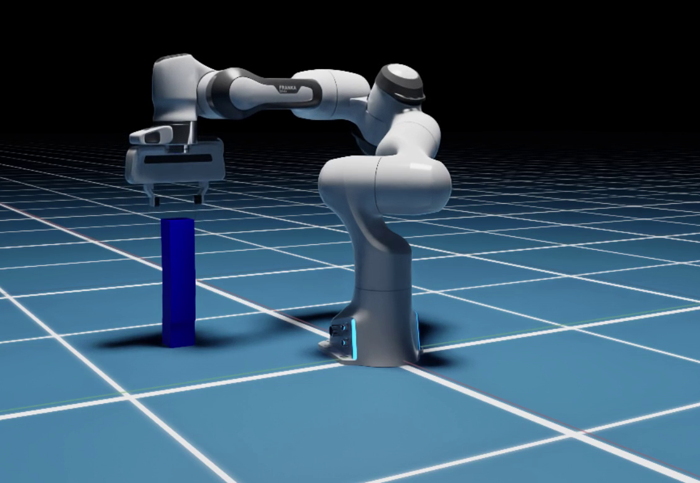

<!------ PROJECT TITLE ------>

    

    

<!------ WHAT ------>

    

<h1>🎀 Essence of the Project</h1>

This project showcases the integration and control of the Franka Emika robot within NVIDIA Isaac Sim to automate the stacking of blocks. Utilizing sophisticated robotics control algorithms, this simulation demonstrates how precise robotic manipulation is achieved in complex tasks such as stacking, providing a platform for further research and development in automated robotics systems.

  

 
    

<!------ WHY ------>

    

<h1>🎯 Project Vision</h1>

The vision behind this project is to demonstrate the capabilities of robotic systems in performing precise and delicate tasks such as stacking, which require high accuracy and stability. Block stacking is fundamental to various applications, including automated warehousing, assembly lines in manufacturing, and construction robotics. By simulating these tasks within NVIDIA Isaac Sim, this project aims to provide insights into the challenges and solutions in robotics control, paving the way for implementing these techniques in real-world applications, where such skills can significantly enhance efficiency and precision.

 
    

<!------ HOW ------>

    

<h1>🪓 Project Implementation</h1>

<h2>💠 Software Design & Tools </h2>

The implementation leverages Ubuntu and Linux as the operating systems, with Python scripting within the NVIDIA Isaac Sim environment. The project utilizes advanced robotics simulation tools, including the precise control mechanisms provided by the Isaac Sim Pick and Place Controller, allowing for detailed manipulation and interaction with the simulated environment.

 &nbsp;
 &nbsp;
 &nbsp;
 &nbsp;
 &nbsp;

   

<!------ Technical Terms ------>

<h2>💠 Project Technical Terms & Concepts </h2>

<h3>▸ What are Cobots?</h3>

Cobots, or collaborative robots, are designed to work alongside humans within a shared workspace. Unlike traditional industrial robots, cobots are built with advanced sensors and AI capabilities to safely interact with human operators, enhancing productivity and flexibility in tasks such as assembly and material handling.

  

<h3>▸ What is Franka Emika Robot?</h3>

The Franka Emika Robot is a highly adaptive and flexible collaborative robot (cobot) designed for a variety of automation tasks. Known for its precision and safety features, it's widely used in research and industrial applications to perform complex tasks such as assembly, testing, and delicate manipulations.

  

<h3>▸ What is Pick and Place Controller in Isaac?</h3>

In NVIDIA Isaac Sim, the Pick and Place Controller is a specialized module that enables robots to handle objects with precision. It integrates robotics kinematics and sensors to accurately control the picking and placing actions, essential for tasks requiring fine manipulation and spatial accuracy.

  

<!------ Deployment and Testing ------>

<h2>💠 Deployment and Testing</h2>
  

This phase involved rigorous testing in NVIDIA Isaac Sim, where the Franka Emika robot successfully demonstrated its capability to manipulate and stack blocks accurately. Below images showcase the successful manipulation and stacking of blocks, culminating in a final arrangement where all five blocks have been neatly stacked.

    

  

    

  

    

  

    

  

    

   

<!------ Result and Analysis ------>

<h2>💠 Result and Analysis </h2>

The results were of high accuracy as demonstrated by the blocks being placed perfectly one upon another. The implemented counting mechanism ensures the robot maintains an accurate count of all blocks, and the precise control from the Pick and Place controller resulted in excellent manipulation accuracy, as displayed in the video and the images above.

  

<!------ HOW TO USE MY CODE ------>
<h2 align="left">💠 How to use my code?</h2>

The provided Python script leverages the entire block manipulation using the Franka robot within NVIDIA Isaac Sim, meaning that in order to use my code, a fully functional Nvidia Isaac Sim setup is necessary.

<ol>
  <li>Ensure Nvidia Isaac Sim is installed along with all other necessary software and environment dependencies.</li>
  <li>Place the Python script named <code>HK_FrankaRoboticArm_Isaac.py</code> in the root directory of Isaac Sim, specifically within the examples folder of the <code>Hello World Directory</code>.</li>
  <li>After opening Isaac Sim, navigate to Isaac Examples, then Hello World.</li>
  <li>Using Hot-reload, press Ctrl + S, then load the world and click the reset button to start the simulation.</li>  
</ol>

If you're a beginner, follow this documentation along with my code: Documentation = <a href="https://docs.omniverse.nvidia.com/isaacsim/latest/core_api_tutorials/tutorial_core_adding_manipulator.html">Adding Manipulator Robots using Nvidia Isaac Sim</a>

    

 
    

<!------ End Image ------>

    

