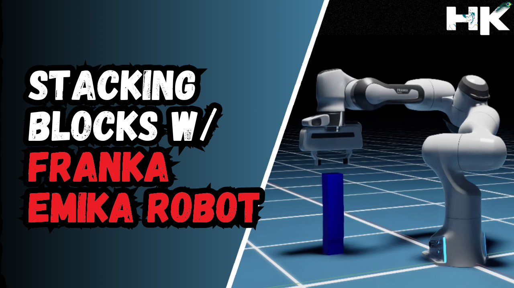

<!------ PROJECT TITLE ------>

    

    

<!------ WHAT ------>

    

<h1>🎀 Essence of the Project</h1>

This project showcases the integration and control of the Franka Emika robot within NVIDIA Isaac Sim to automate the stacking of blocks. Utilizing sophisticated robotics control algorithms, this simulation demonstrates how precise robotic manipulation is achieved in complex tasks such as stacking, providing a platform for further research and development in automated robotics systems.

  

 
    

<!------ WHY ------>

    

<h1>🎯 Project Vision</h1>

The vision behind this project is to demonstrate the capabilities of robotic systems in performing precise and delicate tasks such as stacking, which require high accuracy and stability. Block stacking is fundamental to various applications, including automated warehousing, assembly lines in manufacturing, and construction robotics. By simulating these tasks within NVIDIA Isaac Sim, this project aims to provide insights into the challenges and solutions in robotics control, paving the way for implementing these techniques in real-world applications, where such skills can significantly enhance efficiency and precision.

 
    

<!------ HOW ------>

    

<h1>🪓 Project Implementation</h1>

<h2>💠 Software Design & Tools </h2>

The implementation leverages Ubuntu and Linux as the operating systems, with Python scripting within the NVIDIA Isaac Sim environment. The project utilizes advanced robotics simulation tools, including the precise control mechanisms provided by the Isaac Sim Pick and Place Controller, allowing for detailed manipulation and interaction with the simulated environment.

 &nbsp;
 &nbsp;
 &nbsp;
 &nbsp;
 &nbsp;

   

<h2>💠 Deployment and Testing</h2>

    

<h2>▸ Manipulation Sequence Planning</h2>

▸ I have designed the algorithm for the robotic arm in a way that is referred to as 'manipulation sequence' or 'manipulation planning' in robotics. When the robot's chassis already holds one or two blocks, it needs space to place an additional block. My developed algorithm directs the arm to push the existing blocks slightly backward, creating room for the new one. This process can repeat for any number of blocks, as demonstrated in the video.  

<h2>▸ Implemented Safety Measures for Operating AMRs/AGVs</h2>

As we all know, robots can pose a hazard if we enter their operational zone. To address safety concerns on sites and factories that use mobile robots and Autonomous Guided Vehicles (AGVs), I have programmed an algorithm to enhance safety communications. When the robot is performing a manipulation task, it emits a flashing red light. Conversely, when the robot is merely moving around, it emits a green light, signaling to humans that it is safe to approach. However, it is unsafe to approach when the robot flashes a red light. 
  

<h2>Red: Danger</h2>

  

  

<h2>Green: Safe</h2>

  

 
    

<!----- End Image ----->

    

