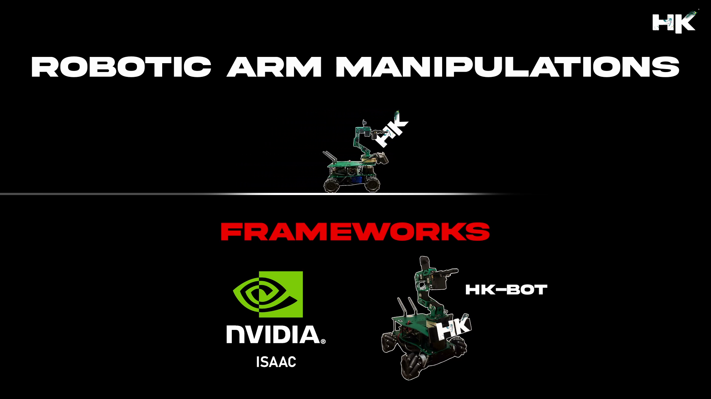

© Documentation by tvharikrishna

1 minute read 📚
  

    

  

# 🔻 Repository Details

This repository is dedicated to exploring and developing algorithms for robotic hand manipulations, including detection and grabbing algorithms, grasp estimation, and methodologies for handling objects in the real world using robotic hands. It aims to advance the capabilities of robots in performing tasks that require fine motor skills and adaptive responses.

<table align="center">
<thead>
<tr>
<th align="center">Naming Prefix</th>
<th align="center">Description</th>
</tr>
</thead>
<tbody>
<tr>
<td align="center"><strong>HKIsaac__</strong></td>
<td align="center">Simulations in Nvidia Isaac</td>
</tr>    
<tr>
<td align="center"><strong>HKBOT__</strong></td>
<td align="center">Projects on HKBOT (Custom Made Mobile Robot)</td>
</tr>
</tbody>
</table> 

# 🔻 What is Robotic Arm Manipulations?

Robotic arm manipulation involves the use of robotic arms to interact with the environment in a way that mimics the human hand's precision and versatility. This field encompasses algorithms for detection, grasping, and manipulation of objects, enabling robots to perform complex tasks such as picking, placing, assembling, and more. Key areas of focus include grip and grasp estimation, object recognition, and the seamless execution of tasks in varied and dynamic environments.
 
    

    

